# ProprietaryChatApp
A real-time one-to-one, many-to-many chat application. Built with `Express-Typescript`, `ReactJS`, `MongoDB`, `ViteJS` and `Docker`.


## Overview

**Features implemented in this Chat application:**
- Supports multiple user registration including:
  - username
  - email
  - profile image
- One-to-one chat support with the following UX:
  - one user can search for other using username/email
  - online/offline status for corresponding chat partner
  - shows typing status when partner is typing
- Many-to-many group chat support including:
  - any user can make groups using existing users
  - group creator is the admin(has rights to change group name, add or remove members, etc.)
  - any person not added to group can't access chats
- Notifications are showed if someone messaging is not currently being viewed.

## Screenshots

### Signin and Signup:
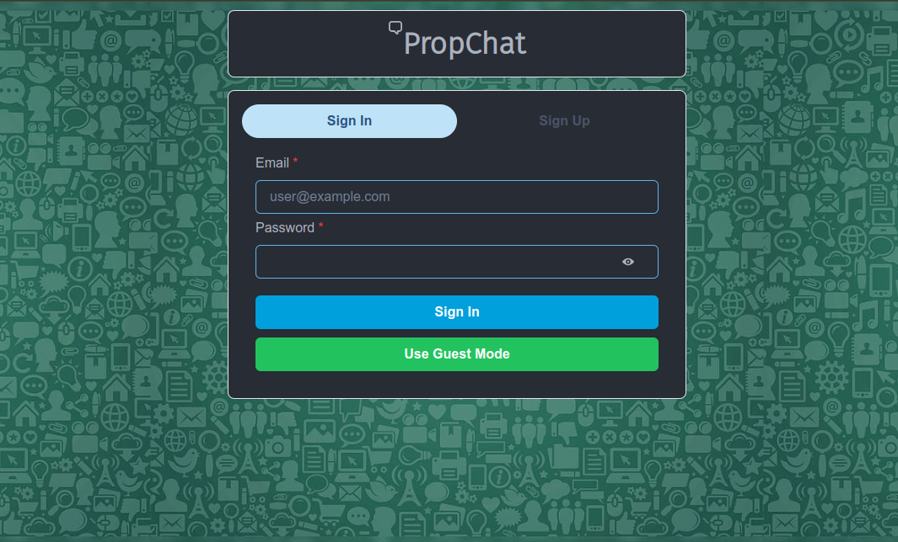
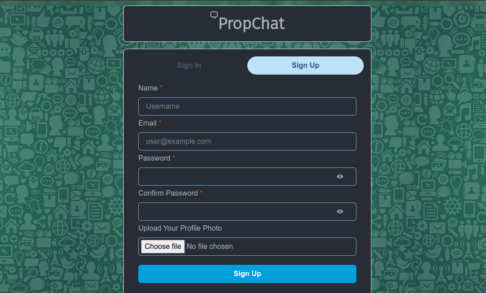

### Dashboard:
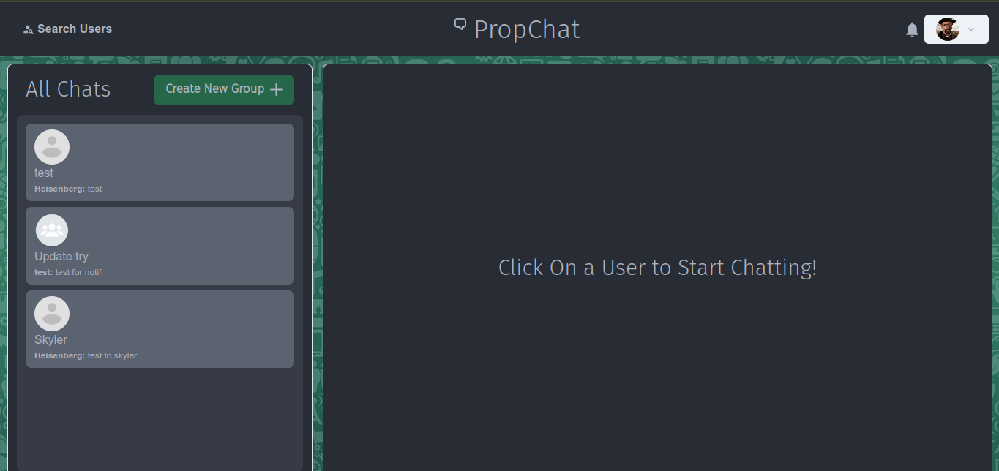

### Chat Interface:
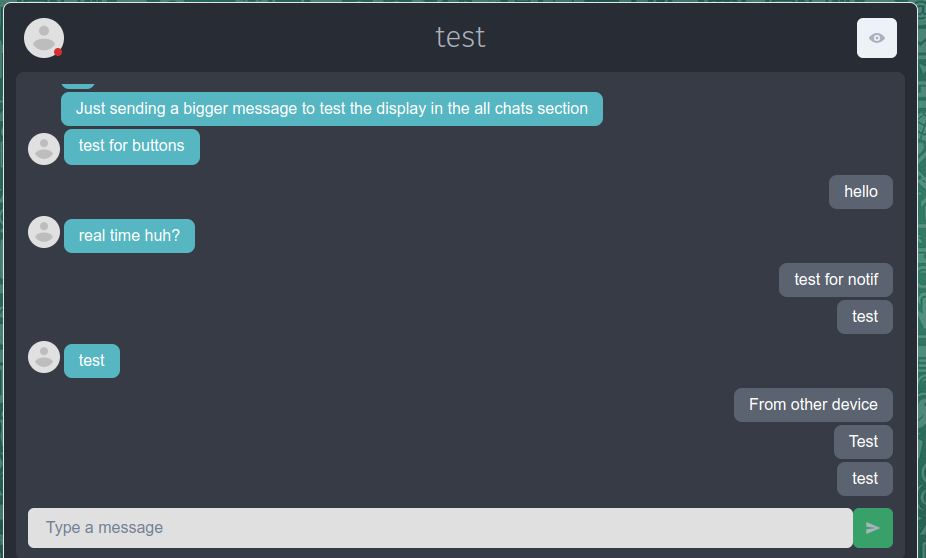
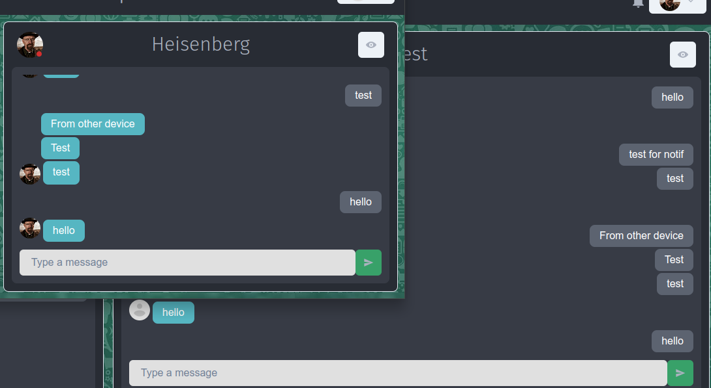

### Group Chat Features:
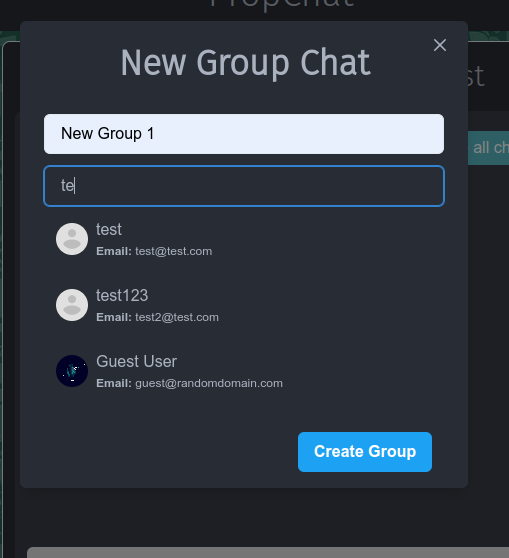
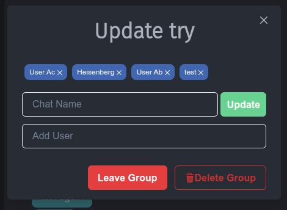

### View Profile & Search Users:
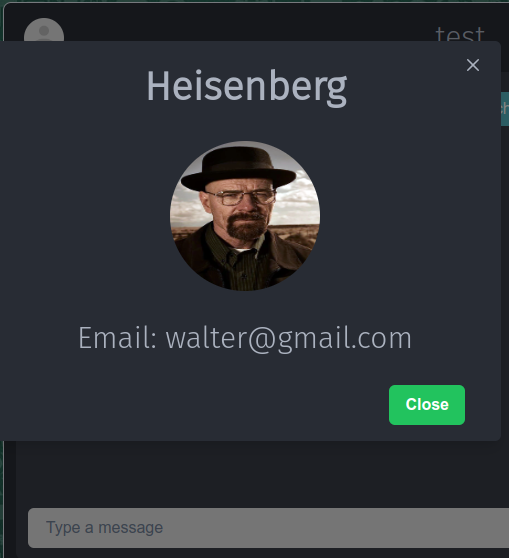
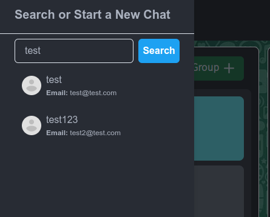

### Special Features(Online/Offline, Typing, notifications):
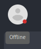

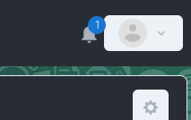
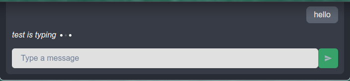

## Usage:

- If you have **nodeJS** installed and **mongoDB** configured then follow the steps:
  - create an `.env` file similar to `.env.example` with suitable values.
  - Run `npm install -g typescript` for installing typescript support.
  - Run `npm install` inside both _frontend_ and _backend_ folders.
  - Run backend first using `npm start`.
  - Then start frontend using `npm run dev`, alternately you can also build and run using nginx.
  - Access the web app at `localhost:5173`.
- If you have **docker** installed, then simply run with:
```
docker compose up
```

_P.S-The name **ProprietaryChatApp** is intentionally given to mock the person who gave the assignment as they think the idea of a chat application is their own creation!!!_
